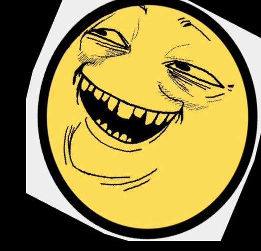
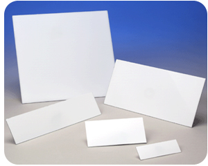
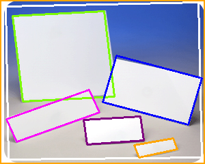
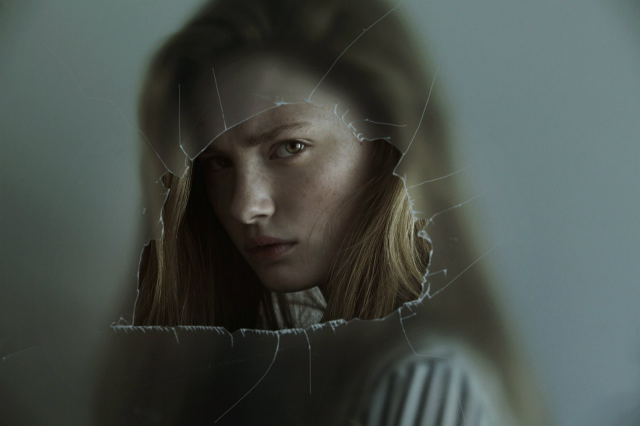
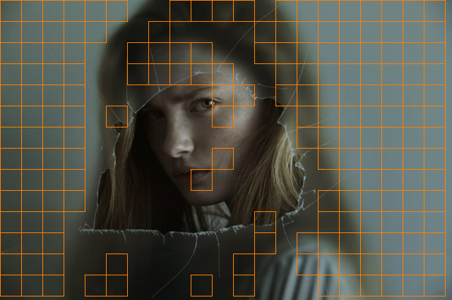
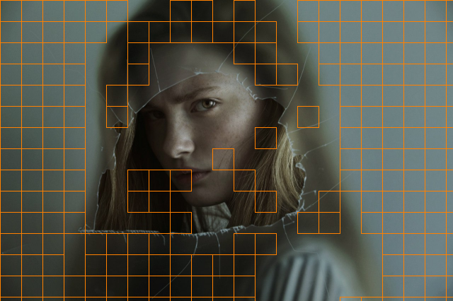
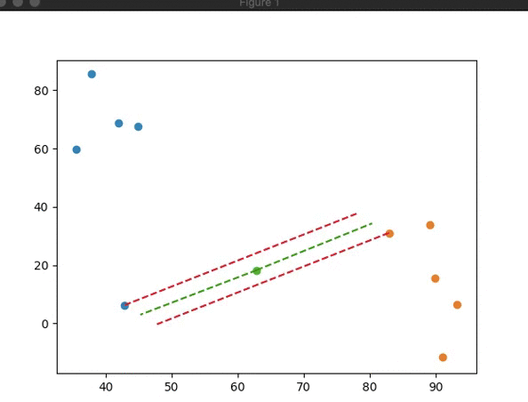
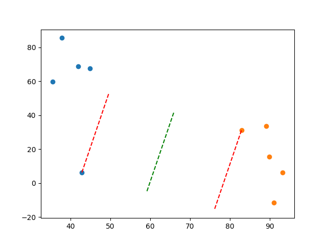

# ML

Prerequisites

- make user python 3.7 is used. ml shit doesnt support 3.8

- set up and activate venv
```bash
python3 -m venv ./venv
source venv/bin/activate
pip install -r requirements.txt 
```


## Image editor. lab 1

Аугументация.

Реализовать программу (python или C++), на вход которой подаётся изображения, а на выходе должно быть несколько изображений:

- Повороты этого изображения на некоторый угол
- Смещение этого изображения по оси x и по оси y
- Сжатие и растяжение
- Параллельный перенос
- Симметрия

#### Usage

```bash
cd image_edit
python editor.py
```

```python
ImgEditor('source.png') \
    .rotate(RotationPoint.CENTER, angle=10) \
    .shrink(x_factor=0.9) \
    .translate(y_offset=20) \
    .save('dest.png')
```

#### Before


#### After




## Square detector. lab 2.1

Для выбранных изображений (см почту) реализовать распознавание границ геометрических фигур. 
Распознанные границы нанести на рисунок (другим цветом).

#### Usage

```bash
cd square_contours
python contours.py
```

#### Before



#### After




## Blur detector. lab 2.2

Реализовать алгоритмы распознавания размытого изображения и региона

- Tenengrad (TENG)
- Normalized Gray Level Variance (GLVN)

Для региона указать координаты размытого региона на изображении.

```bash
cd blur
python blur.py
```

#### Before



#### After





## Support Vector Machine (SVM from scratch). lab 3

Реализовать алгоритм обучения с учителем - метод опорных векторов самостоятельно. 

Была реализована наивная, учебная версия как proof-of-concept, т.к. что SVM работает, только для линейно разделимых наборов данных.

#### Usage
```python
# fit to data
labeled_data = {
    'a': [Point(10, 20), Point(13, 37), Point(14, 48)],
    'b': [Point(-5, 16), Point(12, 90), Point(40, 30)]
}

svm = SVMFromScratch()
svm.fit(labeled_data)

# predict new data
predicted_clazz = svm.predict(Point(70, 40))
```


#### In action



#### Result


